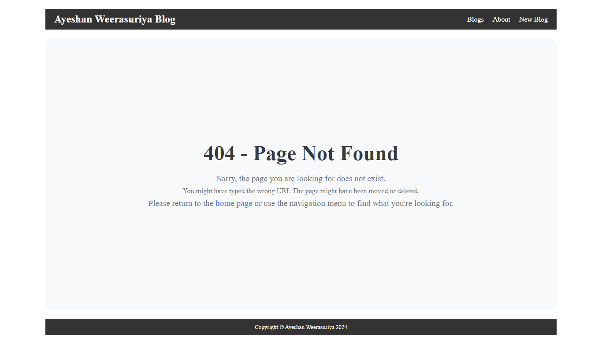

# Blog Site

Welcome! This project was created while learning Node.js and Express.js. The site uses EJS as the view engine to render dynamic web pages.

## Project Overview

This blog site allows users to:

- View blog posts
- Navigate through different pages using Express.js routes
- Delete blog posts

## Technologies Used

- **Node.js**: A JavaScript runtime built on Chrome's V8 JavaScript engine.
- **Express.js**: A minimal and flexible Node.js web application framework.
- **EJS**: A simple templating language that lets you generate HTML markup with plain JavaScript.
- **MongoDB**: A NoSQL database used for storing application data.

## Features

- **Express.js Routes**: Easy navigation and handling of different routes.
- **EJS View Engine**: Dynamic content rendering using EJS templates.
- **MongoDB Integration**: Robust data storage and retrieval with MongoDB.

## Preview

### Home page with all the blogs

### View detailed blog posts after navigating inside

### About Page

### Create new blog page

### This page shows a 404 error page when a user navigates to a non-existent route

